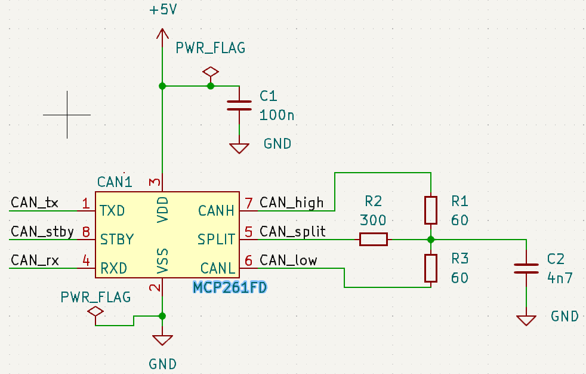

# Overview

This is a small project to understand how to use a fdcan on the nucleo stm32g474RE, and the MCP261FD as fdcan transceiver.
The nucleo stm32g474re is required, but you can use any fdcan transceiver you wish.

The exchange speed is **500kbit/s** and the data length is **32 bytes**.

This project was inspired by [soarbear repository](https://github.com/soarbear/stm32g4-fdcan/tree/master) but it uses platformIO instead of stm32cubeIDE.

# How to use the project

First clone the project :

```
git clone https://github.com/Knden/FDcan_stm32G474re.git fdcan_project
```

there are two ways to use the project.

## Use vscode and platformIO extension (recommended)

Open [Vscode](https://code.visualstudio.com/) and install [platformIO extension](https://marketplace.visualstudio.com/items?itemName=platformio.platformio-ide).

open the folder fdcan_project with visual studio code, and you should see these new icons at the botom :


Click on the arrow ➡️ to compile and flash the code. Make sure the nucleo is connected to the computer.

## Use command line and python

If you wish to use only command line to flash the code, I recommend creating a virtual environment (make sure that you are in fdcan_project root) :


```
python3 -m venv venv
source venv/bin/activate
```

Then install platformIO with pip by installing the required packages in requirements.txt :

```
pip install -r requirements.txt
```

You can use the pio command line to flash the code to flash the code in the MCU :

```
pio run --target upload
```

# What the code do

This code uses two fdcan of the stm32g474, the fdcan 1 and fdcan 2 thus you need two transceivers to use it. For this project I used the MCP261FD but you can use any fdcan transceiver you wish.



Here is the full schematic :


The source of the picture above comes from [soarbear website](https://memo.soarcloud.com/stm32g4-fd-can-in-normal-mode/). Here he uses the mcp2562 instead of the mcp2561 but the schematic is almost the same. The only difference is the presence of the split pin in the mcp2561.

## Settings

The exchange speed is fixed at 500Kbits/s, the data length is 32 bytes. Here is how it works :

- Every 500 ms, the fdcan 1 is transmit a message to the fdcan 2, he increments the value of data by one.
- After receiving the 32 datas, will display it on the serial monitor.

The serial monitor allows you to see what the MCU display when we uses ̀`printf`.

If you are using platformIO on vscode just click on socket icon at the botom  and you'll see what is currently displayed by the serial monitor.

Else, you can choose your favorite software for serial monitor, the only thing you need to know is that the baudrate is **115200**. I recommend the extension [serial monitor](https://marketplace.visualstudio.com/items?itemName=ms-vscode.vscode-serial-monitor) for vscode.

## Expecting results

Every 500 ms the fdcan2 will receive 32 datas from fdcan1 and display in the serial monitor. Here is what you should see at start :

```
preparing to send datas ...


 fdcan2 received data: 1, 1, 1, 1, 1, 1, 1, 1, 1, 1, 1, 1, 1, 1, 1, 1, 1, 1, 1, 1, 1, 1, 1, 1, 1, 1, 1, 1, 1, 1, 1, 1,
 fdcan2 received data: 2, 2, 2, 2, 2, 2, 2, 2, 2, 2, 2, 2, 2, 2, 2, 2, 2, 2, 2, 2, 2, 2, 2, 2, 2, 2, 2, 2, 2, 2, 2, 2,
 fdcan2 received data: 3, 3, 3, 3, 3, 3, 3, 3, 3, 3, 3, 3, 3, 3, 3, 3, 3, 3, 3, 3, 3, 3, 3, 3, 3, 3, 3, 3, 3, 3, 3, 3,
```

The data sent by fdcan1 are incremented each time.

# To go further

- For now the fdcan2 is not answering to fdcan1 i'll add that later
- The current framework used in platformIO is stm32CubeIDE but i'll try to use zephyr rtos after (and maybe CMSIS ?).